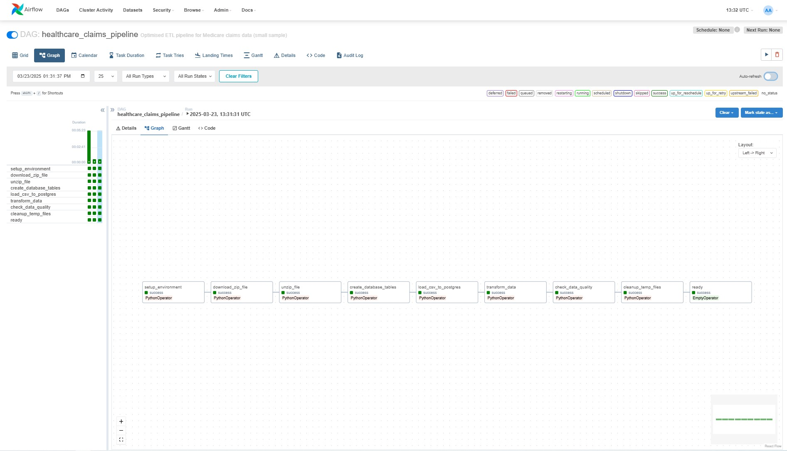

# Healthcare Claims Data Pipeline

## Project Overview

This project demonstrates a production-ready data pipeline for processing healthcare claims data using Apache Airflow. The pipeline extracts synthetic Medicare claims data from the CMS (Centers for Medicare & Medicaid Services), loads it into a PostgreSQL database, transforms it into a more analytical format, and includes data quality checks.




## Features

- **Automated ETL Pipeline**: Extract, transform, and load healthcare claims data
- **Apache Airflow Orchestration**: Reliable workflow management with proper task dependencies
- **Memory-Efficient Processing**: Only processes a small sample (1,000 records) to save disk space
- **Proper Cleanup**: Removes temporary files after processing to minimise storage requirements
- **Data Transformation**: Derives useful metrics like readmission risk, case complexity, and more
- **Error Handling**: Includes robust error handling and fallback mechanisms
- **Healthcare Domain Knowledge**: Implements healthcare-specific transformations and quality checks

## Project Structure

```
healthcare-claims-pipeline/
├── dags/
│   └── healthcare_claims_dag.py   # Main Airflow DAG definition
├── data/                        # Directory for temporary data files
├── logs/                        # Airflow logs
├── docker-compose.yml           # Docker configuration
├── init-claims-db.sql           # Database initialisation script
└── README.md                    # This documentation
```

## Technical Implementation

### Data Pipeline Flow

1. **Setup**: Prepares environment and cleans any existing temporary files
2. **Extraction**: Downloads claims data from CMS and extracts it (limited to save space)
3. **Loading**: Loads raw claims data into PostgreSQL with proper schema
4. **Transformation**: Creates an enhanced analytical view with derived metrics
5. **Validation**: Performs data quality checks
6. **Cleanup**: Removes all temporary files to conserve disk space

### CMS Data Source

The pipeline uses the Synthetic Public Use Files (SynPUFs) from CMS, which contain synthetic Medicare claims data that mimics real-world patterns without exposing actual patient information. This dataset is commonly used for healthcare analytics development.

### Technologies Used

- **Apache Airflow**: Workflow orchestration
- **Python**: Core programming language
- **PostgreSQL**: Data storage
- **Pandas**: Data manipulation
- **Docker**: Containerisation for development

## Running the Project

### Prerequisites

- Docker and Docker Compose
- Git
- 4GB+ RAM allocated to Docker
- 10GB+ free disk space

### Setup Instructions

1. **Clone the repository**:
   ```bash
   git clone https://github.com/yourusername/healthcare-claims-pipeline.git
   cd healthcare-claims-pipeline
   ```

2. **Create required directories**:
   ```bash
   mkdir -p dags data logs
   ```

3. **Copy the DAG file**:
   ```bash
   cp healthcare_claims_dag.py dags/
   ```

4. **Set Airflow user ID (Linux only)**:
   ```bash
   echo -e "AIRFLOW_UID=$(id -u)" > .env
   ```

5. **Start the containers**:
   ```bash
   docker-compose up -d
   ```

6. **Access Airflow UI**:
   Open your browser and navigate to http://localhost:8080
   - Username: airflow
   - Password: airflow

7. **Run the pipeline**:
   - Find the `healthcare_claims_pipeline` DAG
   - Enable the DAG by toggling the switch
   - Trigger the DAG manually by clicking the "Play" button

8. **Monitor progress** in the Airflow UI and explore the task logs

9. **Access the data** via pgAdmin at http://localhost:5050
   - Email: admin@example.com
   - Password: admin
   - Add a new server:
     - Name: Local PostgreSQL
     - Host: postgres
     - Port: 5432
     - Username: airflow
     - Password: airflow
     - Database: claims

### Shutting Down

```bash
docker-compose down
```

To completely clean up, including volumes:
```bash
docker-compose down -v
```

## Insights and Analytics

The pipeline creates several analytical views in PostgreSQL:

- **High-Cost Claims**: Identifies the most expensive claims
- **Emergency Admissions**: Shows all emergency hospital admissions
- **Monthly Claims Trend**: Aggregates claims data by month for trend analysis

## Future Enhancements

- Add machine learning models for risk prediction
- Implement provider performance metrics
- Scale to handle full-size CMS data using Spark
- Add automated alerts for unusual claim patterns

## License

This project is licensed under the MIT License - see the LICENSE file for details.

## Acknowledgements

- [CMS Synthetic Data](https://www.cms.gov/Research-Statistics-Data-and-Systems/Downloadable-Public-Use-Files/SynPUFs) for providing realistic healthcare data
- The Apache Airflow community for their excellent documentation
